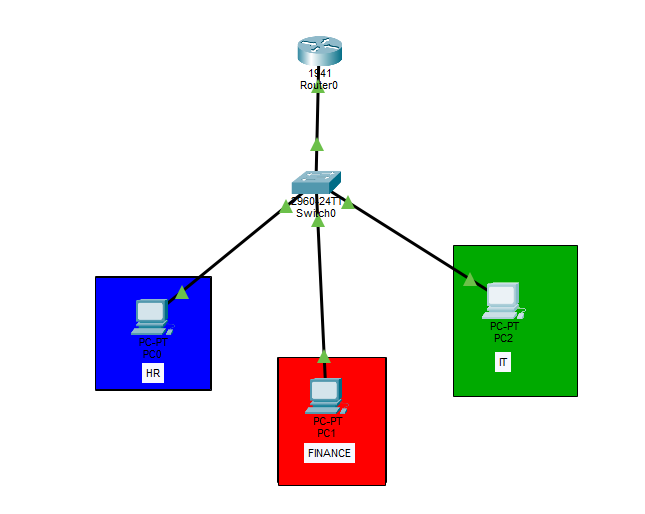
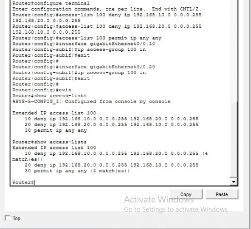
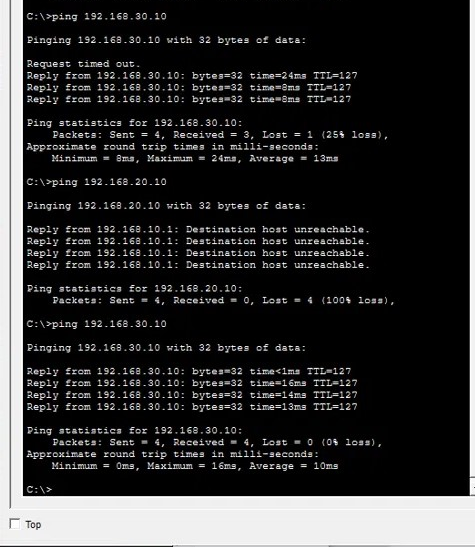

# VLAN Segmentation & ACL Security Lab

## Summary
I segmented a single-switch network into three departments (HR, Finance, IT) using VLANs, connected them to a router using Router-on-a-Stick, and then used an Extended ACL to control which departments can communicate with each other. This project was part of a 45-day cybersecurity analyst roadmap I'm following, focused on understanding networking fundamentals before moving into security tooling.

## The Problem
By default, every device on a switch can reach every other device on that same switch, regardless of department. In a real company, that's a risk — HR should not be able to reach Finance's systems, and Finance shouldn't be able to reach HR's. If one department's device is compromised, an attacker with no restrictions in place could move freely to other departments (lateral movement) instead of being contained.

VLANs solve the first half of this problem by splitting one physical switch into separate logical networks. But VLANs alone aren't enough — a router connecting those VLANs will, by default, still route traffic between them. Segmentation without restriction is organization, not security. That's why this project also required ACLs (Access Control Lists) to actually enforce which departments could talk to each other.

## Design Decisions

**Extended ACL, not Standard.** A Standard ACL only checks the source IP, so it can't target one specific destination — it would block HR from everywhere, not just Finance. Extended checks both source and destination, so I could block HR ↔ Finance specifically and leave IT untouched.

**An explicit permit rule at the end.** Every ACL ends with an invisible "deny all." Without an explicit `permit ip any any` after the two deny rules, IT's traffic would have been silently blocked too, since it wouldn't match either deny rule and would fall through to that implicit deny.

**Router-on-a-Stick, not one interface per VLAN.** Three VLANs would normally need three router ports. One trunk link with 802.1Q tagging lets a single interface serve all three, using subinterfaces as each VLAN's gateway.

**ACL applied inbound, on the subinterface.** Traffic is checked the moment it enters the router, rather than after it's already been processed further — blocking it as early as possible.

## Implementation

**Topology**
Three PCs (HR, Finance, IT), one switch, one router, laid out as below:



**Key configuration**

Creating and naming the VLANs:
```
vlan 10
name HR
vlan 20
name FINANCE
vlan 30
name IT
```

Assigning switch ports to their VLANs:
```
interface fastEthernet0/1
switchport mode access
switchport access vlan 10
```
(repeated for each port, with the matching VLAN)

Trunk port to the router:
```
interface fastEthernet0/3
switchport mode trunk
```

Router subinterfaces (one per VLAN, acting as each VLAN's gateway):
```
interface gigabitEthernet0/0.10
encapsulation dot1Q 10
ip address 192.168.10.1 255.255.255.0
```
(repeated for VLAN 20 and VLAN 30, with matching subnets)

Extended ACL blocking HR ↔ Finance, permitting everything else:
```
access-list 100 deny ip 192.168.10.0 0.0.0.255 192.168.20.0 0.0.0.255
access-list 100 deny ip 192.168.20.0 0.0.0.255 192.168.10.0 0.0.0.255
access-list 100 permit ip any any
```

Applying the ACL to the HR and Finance subinterfaces:
```
interface gigabitEthernet0/0.10
ip access-group 100 in
interface gigabitEthernet0/0.20
ip access-group 100 in
```

## Testing & Evidence

**ACL configuration and rule matches:**



`show access-lists` confirmed the rules were actually being triggered, using the match counters shown against each line — 4 matches on each deny rule and the permit rule, matching the 4 pings sent to each destination.

**Ping tests from HR:**



Pinging Finance from HR returned "Destination host unreachable" on every attempt, rather than a timeout. This distinction matters — a timeout means no response came back at all, while "unreachable" means the router actively responded, confirming it deliberately blocked the packet rather than the destination simply being offline.

HR could still reach IT normally, confirming the ACL only blocked the specific traffic it was meant to, not everything.

## What I'd Improve
- This lab uses Telnet for remote router access, which sends passwords in plaintext. A real deployment should use SSH instead.
- The ACL only restricts HR ↔ Finance. A more complete security posture would define explicit rules for every department pair, rather than relying on a broad permit-all for everything else.
- There's no logging configured on the ACL, so in a real environment I wouldn't have visibility into denied attempts over time, only a live counter.
- This is a simulated environment (Cisco Packet Tracer). Real hardware would introduce additional considerations, like port security and physical access controls.

## Files
- `ROADMAP_Project.pkt` — the Cisco Packet Tracer file, open it in Packet Tracer to explore the full configuration

## Skills Demonstrated
- VLAN segmentation and switch port configuration
- Router-on-a-Stick and 802.1Q trunking
- Extended ACL design and troubleshooting
- Cisco IOS CLI configuration
- Understanding of implicit deny and rule-order logic in access control
